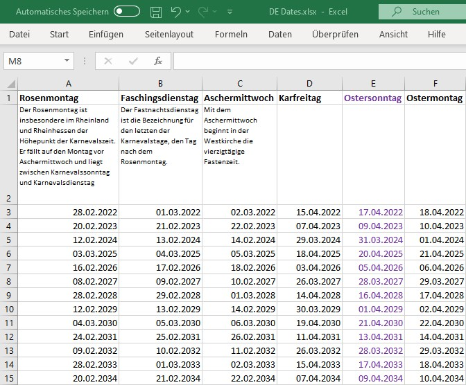

# excel-to-iCal

The script will read an Excel file with dates and will 
generate iCal events for every date.



```
BEGIN:VEVENT
UID:2022-Rosenmontag@lurid_bogey_ical_generator.dummy.local
TRANSP:TRANSPARENT
X-APPLE-TRAVEL-ADVISORY-BEHAVIOR:AUTOMATIC
DTSTART;VALUE=DATE:20220228
DTEND;VALUE=DATE:20220301
SUMMARY:Rosenmontag
END:VEVENT
```
